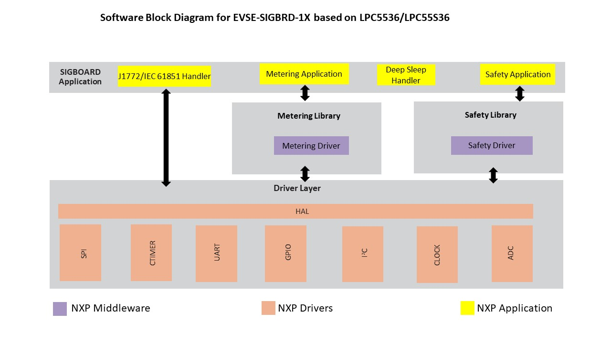

# NXP Application Code Hub

## EVSE-SIG-BRD using LPC5536/LPC55S36 for electric vehicle chargers
* The EVSE-SIG-BRD is an add-on development board that supports electric vehicle supply equipment (EVSE) platform development.
* The board also supports the proximity pilot, ground fault circuit interrupter (GFCI), and relay drive features.
* The main host of the system is on a separate processor development board, for example, NXP i.MX RT1060 EVK, i.MX 8M Nano EVK, or S32G-VNP-RDB3.
* The ISO 15118 protocol stack and communication software run on the host processor. 
* The power-line communication(PLC) path is via the onboard HomePlug Green PHY (HPGP) transceiver (Lumissil IS32CG5317).

#### Boards: EVSE-SIG-BRD1X
#### Categories: Security, Low Power, Industrial, Safety
#### Toolchains: [MCUXpresso IDE V11.9.0 or later](https://www.nxp.com/design/design-center/software/development-software/mcuxpresso-software-and-tools-:MCUXPRESSO?tid=vanmcuxpresso).

## Table of Contents
1. [Software](#step1)
2. [Hardware](#step2)
3. [Setup](#step3)
4. [Support](#step4)
5. [Release Notes](#step5)

## 1. Software
* This software demonstrates the usage of EVSE-SIG-BRD firmware for EVSE application. 
* To build the EVSE-SIG-BRD EVSE sample projects, the following SDK is required: [LPC5536 EVK MCUXpresso SDK v2.14.0](https://mcuxpresso.nxp.com/en/welcome).
* The SDK is available for download at MCUXpresso SDK Builder.

  

EVSE-SIG-BRD software block diagram.

## 2. Hardware
* For this demo you will need the following hardware.
  [EVSE-SIG-BRD1X](https://www.nxp.com/part/EVSE-SIG-BRD1X).

  

EVSE-SIG-BRD top-side view.

## 3. Setup

### 3.1 User need to download/clone the code from the repository.

### 3.2 To build EVSE simulation software, perform the following steps:

### 3.2.1 Step 1 
* Click Import project(s) from the File Menu and select Import Project of MCUXpresso IDE.

### 3.2.2 Step 2 
* Select Existing Project into Workspace and then either select root directory or archive of the project dm-lpc5536-evse-sigbrd.

### 3.2.3 Step 3 
* As per the selected option either provide the root directory or the *.zip file path.

### 3.2.3 Step 3
* Click the Finish button.

### 3.2.4 Step 4
* Click the Build button on the top-left side of the IDE and start building the project. The build should be done without errors.

### 3.2.5 Step 5
* Click the Start Debugging button on the top-left side of the IDE and start programming the board with the project binary. Once the programming is completed, it breaks at a breakpoint at the main() function of the code.

### 3.2.5 Step 6
* To resume the operation, click the Run button.

### 3.3 If user wants to program the board directly then select the binary evsesigbrd_sw_v1.1.5.bin from Binary folder and flash the board using GUI Flash Tool of MCUXpresso IDE.

## 4. Support

Questions regarding the content/correctness of this example can be entered as Issues within this GitHub repository.

>**Warning**: For more general technical questions regarding NXP Microcontrollers and the difference in expected funcionality, enter your questions on the [NXP Community Forum](https://community.nxp.com/)

## 5. Release Notes
| Version | Description / Update                    |                      Date |
| :-----: | --------------------------------------- | ------------------------: |
|   1.0   | Initial release on Application Code Hub | July 8th 2024 |

